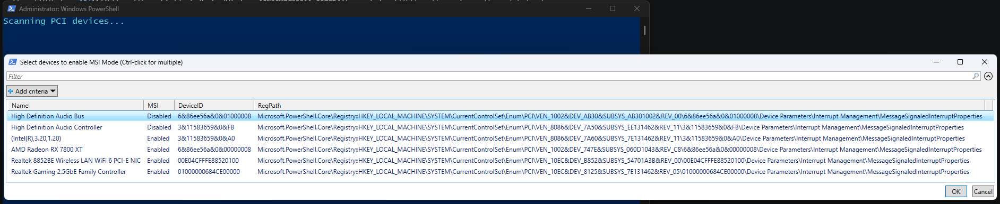

<div align="center">

# MSI Mode Utility

**Enable MSI mode. Cut DPC latency. Fix input lag.**

An open-source PowerShell script to view and toggle **MSI (Message Signaled Interrupts) mode** for PCI devices on Windows 10/11 — a transparent alternative to the closed-source "MSI Util v3" `.exe` from forum threads.
Zero install. Zero dependencies. Built-in undo.

[](https://github.com/vadyaravadim/msi-mode-utility/actions/workflows/lint.yml)
[](LICENSE)
[](https://www.microsoft.com/windows)
[](https://docs.microsoft.com/en-us/powershell/)
[](https://github.com/vadyaravadim/msi-mode-utility/releases)


</div>

---



## Quick Start

**Easiest — download & double-click:**

1. Click **Code ▸ Download ZIP** at the top of this page, then unzip.
2. Double-click **`Run.bat`**.
3. Click **Yes** on the UAC prompt (the script requests admin rights on its own).
4. In the grid window, `Ctrl`-click the devices you want, then click **OK**.
5. **Reboot.**

**One-liner** instead (in any PowerShell — it self-elevates):

```powershell
irm https://raw.githubusercontent.com/vadyaravadim/msi-mode-utility/main/msi-mode-utility.ps1 | iex
```

The script downloads itself to `%USERPROFILE%\msi-mode-utility.ps1` (not a temp folder) on purpose: the `msi_undo_*.reg` rollback file is written next to it and must survive automatic temp cleanup. An existing copy at that path that differs is kept as `.bak`. The optional switches below need a local copy of the script — use the ZIP or clone method for those.

**Or clone:**

```powershell
git clone https://github.com/vadyaravadim/msi-mode-utility.git
cd msi-mode-utility
.\Run.bat
```

### Optional switches

| Switch | Effect |
| --- | --- |
| `-ShowAll` | Show every MSI-capable PCI device, including bridges/controllers hidden by default |
| `-Disable` | Turn MSI **off** for the selected devices |

## What It Does

1. **Scans** PCI devices and shows the latency-critical ones (GPU, network, USB, audio) in a grid with their current MSI status
2. **Backs up** the previous state of every selected device to a timestamped `msi_undo_*.reg` file next to the script (on your Desktop when run via the one-liner) — **before** changing anything
3. **Enables MSI mode** for the devices you selected (sets the documented `MSISupported` registry value)

Rollback = double-click the undo file, then reboot. No System Restore needed — works from Safe Mode too.

## The Problem: Line-Based (IRQ) vs Message Signaled Interrupts

Legacy line-based (IRQ) interrupts share physical lines, so a device can be forced to wait or collide with others. MSI lets a device signal the CPU by writing to a memory address instead — interrupts are delivered faster and without line-sharing conflicts. Windows leaves many devices in legacy mode even when their driver supports MSI.

**Symptoms this fixes:**

- DPC latency spikes and frame-time stutters despite high FPS
- Audio popping / crackling under load
- Input lag from slow servicing of mouse/keyboard interrupts

## Requirements

| | |
|---|---|
| **Windows** | 10, 11 |
| **PowerShell** | Windows PowerShell 5.1 (ships with Windows 10/11). Uses `Out-GridView` — built into Windows PowerShell 5.1; PowerShell 7 needs the `Microsoft.PowerShell.GraphicalTools` module; **not** available on Server Core. The script detects a missing `Out-GridView` and tells you what to do |
| **Rights** | Administrator (the script self-elevates via UAC) |

## How It Works

The MSI flag lives at:

```
HKLM\SYSTEM\CurrentControlSet\Enum\PCI\<class>\<instance>\Device Parameters\Interrupt Management\MessageSignaledInterruptProperties
    Value: MSISupported  (DWORD)   1 = MSI on, 0 = off
```

MSI-capable devices always have the `Interrupt Management` key, but the `MessageSignaledInterruptProperties` subkey and `MSISupported` value **often don't exist until you enable MSI** — so the script creates them as needed rather than only flipping existing values.

When the value is absent, the grid shows **Default** (not "Disabled"): it means no explicit override is set and the driver default applies — an MSI-X-capable device may already be running in MSI-X mode regardless of this key.

## Verify: Check If MSI Mode Is Enabled

After the reboot, confirm the device actually runs in MSI mode:

- **Device Manager** → device → **Properties ▸ Resources**: a **negative IRQ number** (e.g. `-3145728`) means message-signaled interrupts are active; a small positive number means legacy line-based mode.
- **msinfo32** → Hardware Resources ▸ IRQs: same rule — negative IRQ values are MSI/MSI-X devices.
- Or just run the script again — the grid shows the current `MSISupported` state of every device.

## Reverting

Two options:

1. Double-click the `msi_undo_*.reg` file created before your change, then reboot (restores the previous `MSISupported` state, works from Safe Mode). If you ran the script several times against the same device, apply the undo files newest-to-oldest — each one is a snapshot of the state before *that* run, so only the oldest holds the original state.
2. Run the script again with `-Disable` and select the same devices. Note: this writes an explicit `MSISupported = 0`; if the device originally had no `MSISupported` value at all (shown as **Default** in the grid), only the undo file restores that exact state.

Prefer a System Restore point anyway? Create one yourself before running: `Checkpoint-Computer -Description "Before MSI"` (note: Windows silently skips it if a point was made within the last 24 hours).

## FAQ

### What is MSI mode?

MSI (Message Signaled Interrupts) is a way for a PCI/PCIe device to deliver interrupts by writing to a memory address instead of asserting a shared physical IRQ line. Interrupts arrive faster and without line-sharing conflicts, which lowers DPC latency.

### Does enabling MSI mode reduce input lag or increase FPS?

It mainly improves **DPC latency, frame-time consistency, and interrupt servicing latency** — not average FPS. MSI on the GPU tends to reduce the DPC latency spikes that cause frame-time stutters; MSI on the USB host controller reduces the latency of mouse/keyboard interrupts being serviced, which can lower perceived input lag.

### Is it safe to enable MSI mode?

`MSISupported` is a documented, reversible registry value. Before every change the script saves a `.reg` undo file with the previous state of the values it changes. Worst case, a device that misbehaves with MSI reverts as soon as you apply the undo file and reboot (works from Safe Mode too).

### Should I enable MSI mode for my NVIDIA or AMD GPU?

GPUs are the most common target for this tweak. Some NVIDIA and AMD driver/board combinations leave the card in legacy line-based mode — the grid shows the current state, so you don't have to guess. If your GPU shows **Default** or **Disabled** and you see DPC latency spikes or frame-time stutters, enabling MSI is the usual first step. If it already shows **Enabled**, there is nothing to change.

### What is the difference between MSI and MSI-X?

MSI-X is the newer extension of MSI with more interrupt vectors and better CPU distribution. Devices already running in MSI-X mode don't need this tweak. NVMe drives are hidden by default for that reason; GPUs are still shown because whether they use MSI/MSI-X depends on the driver.

### How is this different from MSI Util v3 (MSI Mode Utility)?

MSI Util v3 is a closed-source `.exe` passed around via forum threads. This is a readable, open-source PowerShell script that flips the same documented registry value — but it also filters the list down to latency-critical devices, writes a `.reg` undo file before every change, and leaves no binary on your system. Use whichever you prefer — this is the transparent, scriptable option.

### Where are my NVMe drives?

Hidden by the default filter on purpose: NVMe uses MSI-X out of the box, so there is nothing to gain. Use `-ShowAll` if you want to see them anyway.

### How do I re-enable the old interrupt mode?

Double-click the `msi_undo_*.reg` file saved next to the script (or on your Desktop if you used the one-liner) — see [Reverting](#reverting).

### Does disabling MPO (Multiplane Overlay) help with flickering and stutters?

MPO is a DWM display feature, not an interrupt setting, but it shows up in the same troubleshooting threads: on some GPU/driver combinations it causes flickering, black screens, or stutter in windowed games. The classic fix — DWORD `OverlayTestMode = 5` under `HKLM\SOFTWARE\Microsoft\Windows\Dwm` — is being phased out by Microsoft: it works up to Windows 11 23H2, is unreliable on 24H2, and is ignored on 25H2. That's why there is no "MPO disabler" in this series: a tweak that dies with every Windows release isn't worth a utility. On 23H2 or older, try the registry value (delete it to revert); on newer builds, update your GPU driver instead — NVIDIA, AMD, and Microsoft have been shipping MPO fixes on their side.

## Related

- [Interrupt Affinity Utility](https://github.com/vadyaravadim/interrupt-affinity-utility) — pin GPU, network, USB & audio interrupts to specific CPU cores (P/E-core aware) — the natural next step after enabling MSI mode
- [CPU Parking Disabler](https://github.com/vadyaravadim/cpu-parking-disabler) — disable CPU core parking on Windows 10/11 to fix micro-stutters and input lag
- [Timer Resolution Utility](https://github.com/vadyaravadim/timer-resolution-utility) — set 0.5 ms timer resolution, disable dynamic tick, un-force HPET — with a built-in Sleep(1) benchmark
- [GameDVR & FSO Disabler](https://github.com/vadyaravadim/gamedvr-fso-disabler) — disable Game DVR / Xbox Game Bar capture and Fullscreen Optimizations on Windows 10/11 to fix capture stutters and frame drops
- [Remove Hidden Devices](https://github.com/vadyaravadim/remove-hidden-devices) — remove ghost / hidden devices left behind by unplugged USB sticks, headsets & dongles cluttering Device Manager

Same idea across the series: one transparent PowerShell script, no binaries, you see exactly what changes.

## Disclaimer

Editing interrupt settings can, in rare cases, cause a device to fail to start. A reboot and reverting the value fixes it. Use at your own risk.

## License

[MIT](LICENSE) — use at your own risk.

---

<div align="center">

If this fixed your stutters, consider giving it a ⭐

[Report Issues](https://github.com/vadyaravadim/msi-mode-utility/issues)

</div>
